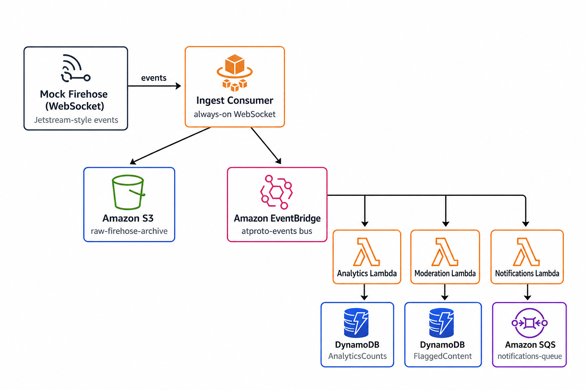

# ATProto Firehose Demo: Ingesting a Decentralized Social Stream on AWS

A small, fully offline demo of an event-driven pattern for ingesting the AT Protocol (ATproto) firehose on AWS: a mock Jetstream-style event emitter feeds an ingest process, which archives raw events to S3 and fans them out via EventBridge to independent, single-purpose consumers (analytics,
moderation, notifications).

The demo has two interchangeable ways to do that ingestion, each its own
standalone, independently deployable stack. One stack delivers near-real-time updates while the other polls for updates on a periodic
basis:

- **`infra-fargate/`** — an always-on Fargate task holds the firehose
  WebSocket open indefinitely. This delivers near-real-time updates but
  requires more infrastructure (a VPC, a container) and will incur more
  costs.
- **`infra-poller/`** — a scheduled Lambda that wakes up every couple of
  minutes, connects just long enough to catch up on what's new, and exits. This is cheaper and simpler to operate but comes with latency based on the poll interval.

Both publish to the exact same EventBridge bus, with the exact same event shape, so the three fan-out Lambdas (analytics, moderation, notifications) are completely unaware of which one is running. See
[two ways to ingest](#two-ways-to-ingest) below for the tradeoffs, or jump straight to whichever [quickstart](#quickstart) matches your use case.

Everything can be run on [LocalStack](https://www.localstack.cloud/) via
[`lstk`](https://github.com/localstack/lstk) without ever hitting real AWS resources. See [LocalStack vs. real AWS](#localstack-vs-real-aws) for when to move workloads to a real account.

### Background

If you're new to ATProto, here's the minimum context:

- **AT Protocol (ATproto)** is the open protocol behind Bluesky that can be used for far more than just social posts.
- Each user has a personal data repository identified by a **DID** (decentralized ID).
- In the case of Bluesky or other similar sites that rely on ATProto, when someone posts, likes, or follows, their repo emits a **commit**, which is a JSON object describing what changed.
- The **firehose** is the real-time stream of those commits across the
  network. Bluesky's [Jetstream](https://github.com/bluesky-social/jetstream) service exposes it as plain JSON over WebSocket (this is easier to consume than the raw binary firehose, which uses CBOR/CAR encoding).
- This demo mocks Jetstream's JSON shape so you can run the full pipeline offline, then swap one URL to point at a real corner of the network — see [pointing at the real firehose](#pointing-at-the-real-firehose-leaflet).



_(This diagram shows the `infra-fargate/` path. The `infra-poller/`
alternative swaps the Fargate box for a scheduled Lambda, but everything to the right of ingestion is identical.)_

## Decision Log

| Decision           | Choice                                                                                                                                      | Why                                                                                                                                                                                                                                                                                                                                                                 |
| ------------------ | ------------------------------------------------------------------------------------------------------------------------------------------- | ------------------------------------------------------------------------------------------------------------------------------------------------------------------------------------------------------------------------------------------------------------------------------------------------------------------------------------------------------------------- |
| Firehose format    | Mock **Jetstream-style JSON**, not raw `subscribeRepos` CBOR/CAR                                                                            | Raw firehose requires CBOR/CAR decoding — genuinely complex and a distraction from the architecture story. Jetstream is what most real integrations use anyway.                                                                                                                                                                                                     |
| Ingest compute     | **Fargate or Lambda** — two interchangeable options                                                                                         | See [two ways to ingest](#two-ways-to-ingest). Fargate holds a persistent connection open; Lambda polls on a schedule. Which one you choose depends on how much latency your use case can tolerate.                                                                                                                                                                 |
| Fan-out mechanism  | **EventBridge**, not direct invocation or SNS                                                                                               | EventBridge is AWS's event bus. Content-based filtering lets each consumer subscribe to exactly what it needs without the ingest side knowing any of them exist. Consumers can be added or removed independently.                                                                                                                                                   |
| Raw storage        | **S3, written before fan-out**                                                                                                              | S3 is object storage. The raw NDJSON log is the source of truth, independent of whatever EventBridge consumers exist today. It enables replay/reprocessing later.                                                                                                                                                                                                   |
| Real-network scope | **Leaflet's collections** (`pub.leaflet.*`), filtered at the source via Jetstream's `wantedCollections`, not the full `app.bsky.*` firehose | The full firehose's volume can quickly overwhelm LocalStack's Lambda/ECS emulation (and its cost on real AWS is untested but presumably non-trivial at that rate). Filtering to a small, real, low-volume app keeps the real-network path genuinely runnable end-to-end on LocalStack. See [pointing at the real firehose](#pointing-at-the-real-firehose-leaflet). |

Whichever ingestion stack you deploy, it only does two things: append every event to S3, and `PutEvents` a normalized version to EventBridge. Neither one has any idea the analytics, moderation, or notifications Lambdas exist, which is the whole point of the pattern.

## Two ways to ingest

Both stacks provision the _identical_ downstream contract: same S3 bucket name, same DynamoDB table names, same SQS queue name, same EventBridge bus and rules, same three fan-out Lambdas. This is exactly what makes them swappable. That also means they can't both be deployed at once. Deploy one, and if you want to try the other, either reset your LocalStack container (`lstk reset`) or, if you're on real AWS, `cdk destroy` it first.

|                       | `infra-fargate/`                                 | `infra-poller/`                                                                                                                        |
| --------------------- | ------------------------------------------------ | -------------------------------------------------------------------------------------------------------------------------------------- |
| Ingestion compute     | ECS Fargate task, always running                 | Lambda, invoked on a schedule (default every 2 minutes)                                                                                |
| Delivery latency      | Near-real-time (~1s)                             | Bounded by the poll interval                                                                                                           |
| Idle cost             | Pays for a running container 24/7                | Pays only per invocation                                                                                                               |
| Extra infra           | VPC, ECS cluster, Fargate service                | One DynamoDB table (`IngestCursor`) to remember where it left off                                                                      |
| How it resumes        | Never disconnects                                | Reconnects with `?cursor=<time_us>`, replaying anything missed — the same mechanism the real Jetstream `/subscribe` endpoint documents |
| The "spike" demo beat | Counters visibly climb in real time as you watch | Trigger the spike, then the next poll (scheduled, or triggered manually) catches the whole burst up in one batch                       |

Use `infra-fargate/` when you want events processed as they happen. Use
`infra-poller/` when near-real-time isn't required and you'd rather not run a container around the clock.

Jump to [quickstart](#quickstart) for `infra-fargate/`, or
[alternative: interval-polling ingestion](#alternative-interval-polling-ingestion-lambda) for `infra-poller/`.

## Repo layout

```
firehose-mock/        Mock Jetstream WebSocket server + canned sample events
ingest-consumer/      Fargate task app code: firehose -> S3 archive + EventBridge PutEvents
ingest-poller/        Lambda app code: same job, run on a schedule instead of held open
lambdas/
  analytics/           counts events per type, per hour
  moderation/           flags comments matching a keyword list
  notifications/        alerts on new subscribers to watchlisted publications
  common/types.ts       shared event shape
infra-fargate/         CDK stack: S3, DynamoDB, SQS, EventBridge, Lambdas, ECS/Fargate
infra-poller/          CDK stack: same storage/EventBridge/Lambdas, scheduled ingest-poller instead
```

## Prerequisites

To run locally on LocalStack, you'll need the following:

- Node.js 22+ and Docker (Docker Desktop on macOS/Windows)
- A valid LocalStack license (Note that the `infra-poller` pipeline will run on a free hobby license but infra-fargate requires ECS, which is part of a paid plan or active trial.)
- [`lstk`](https://github.com/localstack/lstk) installed and able to run
  `lstk start` (log in first with `lstk login` if you have not set your authentication token)

## Quickstart

This walks through the `infra-fargate/` (always-on) path. For the
`infra-poller/` (scheduled Lambda) alternative, do steps 1-2 here, then
skip to [alternative: interval-polling ingestion](#alternative-interval-polling-ingestion-lambda).

**1. Start LocalStack**

```bash
LOCALSTACK_ECR_ENDPOINT_STRATEGY=off lstk start
```

`ECR_ENDPOINT_STRATEGY=off` avoids a per-account ECR subdomain
(`<account>.dkr.ecr.<region>.localhost.localstack.cloud`) that some
machines' DNS resolvers (notably macOS Docker Desktop) fail to resolve,
which otherwise surfaces as a `docker login` timeout or 404 when CDK
pushes the ingest consumer's image in step 3.

If Lambda invocations fail with `Timeout while starting up Lambda environment` on a cold start, restart LocalStack with a higher startup budget (separate from each function's own timeout, which defaults to 3
seconds locally):

```bash
LOCALSTACK_ECR_ENDPOINT_STRATEGY=off LOCALSTACK_LAMBDA_RUNTIME_ENVIRONMENT_TIMEOUT=20 lstk start
```

That is usually only needed on a heavily loaded Docker host. A fresh
`lstk reset` between test runs is normally enough. It clears the
Lambda/ECS containers LocalStack spawned, not just LocalStack's own
container.

**2. Install dependencies** (small, independent npm projects — nothing
shared, nothing to hoist). Skip `ingest-poller`/`infra-poller` here if
you're only running the Fargate path:

```bash
(cd firehose-mock && npm install)
(cd ingest-consumer && npm install)
(cd ingest-poller && npm install)
(cd lambdas && npm install)
(cd infra-fargate && npm install)
(cd infra-poller && npm install)
```

**3. Deploy the stack**

```bash
cd infra-fargate
lstk cdk bootstrap   # one-time per LocalStack instance
lstk cdk deploy --require-approval never
```

CDK builds the ingest consumer's Docker image and pushes it to ECR
automatically. The same command works unchanged against real AWS.

`--require-approval never` skips the "review IAM changes" confirmation
prompt. Without it, `cdk deploy` waits for an interactive y/n answer before touching anything. Drop the flag if you want to review IAM
changes before every deploy against real AWS.

This stands up S3, both DynamoDB tables, the SQS queue, the
EventBridge bus and its three content-filtered rules, all three Lambdas,
and an ECS Fargate service running the ingest consumer.

Give Fargate 30–60 seconds after deploy to pull the container image and
start the ingest consumer. If the verification commands in step 5 return
empty results, wait a moment and try again or watch the logs until you
see `connected to firehose`.

**4. Start the mock firehose** (separate terminal)

```bash
cd firehose-mock
npm start
```

The ingest consumer is already running in Fargate and retrying its
WebSocket connection every 2 seconds — it picks up the stream as soon as
the mock server is listening.

**5. Watch it flow**

```bash
# ingest consumer logs: connecting, flushing NDJSON batches to S3
lstk aws logs tail /atproto-demo/ingest-consumer --follow
```

If this immediately fails with `ResourceNotFoundException ... FilterLogEvents`, you may have tailed logs too quickly after deploying. LocalStack's CloudWatch Logs emulation takes a short moment to make a just-created log group queryable. Wait ~15 seconds and try rerunning the command.

```bash
# the raw archive
lstk aws s3 ls s3://raw-firehose-archive/raw/ --recursive

# live per-type, per-hour counters
lstk aws dynamodb scan --table-name AnalyticsCounts

# comments flagged for moderation (sample data includes comments with keywords like "spam", "scam", "click here")
lstk aws dynamodb scan --table-name FlaggedContent

# queued notifications for watchlisted publications (sample data already includes subscriptions to them)
QUEUE_URL=$(lstk aws sqs get-queue-url --queue-name notifications-queue --query QueueUrl --output text)
lstk aws sqs receive-message --queue-url "$QUEUE_URL" --max-number-of-messages 10
```

You can also review all the resources and data in the browser using the [LocalStack Console](https://app.localstack.cloud/inst/default/status).

The sample data in [`firehose-mock/data/sample-events.ndjson`](firehose-mock/data/sample-events.ndjson) contains a handful of comments with moderation keywords and subscriptions targeting the
notification watchlist, so both tables populate within the
first loop.

**6. Trigger the spike — the dramatic beat**

```bash
curl -X POST http://localhost:8080/spike
```

This collapses the mock firehose's event delay for 15 seconds, simulating a burst of real-world activity (ex. a post going viral). Re-run the `AnalyticsCounts` scan from step 5 before and after. The counters jump noticeably, and every downstream consumer keeps up without any of them knowing a spike happened, or that the other two consumers exist.

**7. Clean up**

Cleaning up LocalStack just requires stopping the container (be sure to also stop the firehose mock). It's suggested that you reset the container before stopping to ensure that all the spawned containers are also cleaned up.

```bash
lstk reset --force
lstk stop
```

Alternatively, you can reset the container to try the next deployment option.

```bash
lstk reset
```

`lstk reset` clears LocalStack state and the Lambda/ECS containers it
spawned. See [LocalStack vs. real AWS](#localstack-vs-real-aws) if you need more aggressive cleanup (e.g. after pointing at the full unfiltered
firehose).

## Alternative: interval-polling ingestion (Lambda)

_If `infra-fargate` is currently deployed, reset your LocalStack container or destroy it first. Both stacks provision identically-named resources, so only one can exist at a time._

This option includes the same same mock firehose and same downstream fan-out, just a different way of getting events onto the bus. Do Quickstart steps 1-2 above first (`infra-poller` needs its own `npm install` too), then:

**1. Deploy `infra-poller` instead of `infra-fargate`**

```bash
cd infra-poller
lstk cdk bootstrap   # one-time per LocalStack instance
lstk cdk deploy --require-approval never
```

**2. Start the mock firehose** (separate terminal)

```bash
cd firehose-mock
npm start
```

**3. Trigger a poll on demand**

The scheduled rule fires every 2 minutes by default (see
`POLL_INTERVAL` in `infra-poller/lib/atproto-poller-stack.ts` to change
it), which is a while to wait around during a live demo. Invoke the
Lambda directly instead. This is the polling path's equivalent of the
Fargate path's `POST /spike`:

```bash
lstk aws lambda invoke --function-name atproto-ingest-poller /dev/stdout
```

Run the same verification commands as the main Quickstart's step 5 (S3,
`AnalyticsCounts`, `FlaggedContent`, the notifications queue) — they all
work identically regardless of which stack published the events. Instead
of tailing logs continuously, check the poller's logs after each
invocation:

```bash
lstk aws logs tail /aws/lambda/atproto-ingest-poller
```

**4. The spike beat, polling-style**

```bash
curl -X POST http://localhost:8080/spike
```

Unlike the Fargate path, nothing happens immediately. The events are
piling up in the mock firehose's rolling history buffer. Invoke the poller (step 3's command) and you can see it catch up the entire burst in a single batch: one S3 archive object, one wave of `PutEvents` calls, one cursor update. The gap in connectivity doesn't lose data, it just gets processed in one go the next time the poller runs.

**5. Clean up**

Cleaning up LocalStack just requires stopping the container (be sure to also stop the firehose mock). It's suggested that you reset the container before stopping to ensure that all the spawned containers are also cleaned up.

```bash
lstk reset --force
lstk stop
```

Alternatively, you can reset the container to try the prior deployment option.

```bash
lstk reset
```

`lstk reset` clears LocalStack state and the Lambda/ECS containers it
spawned. See [LocalStack vs. real AWS](#localstack-vs-real-aws) if you need more aggressive cleanup (e.g. after pointing at the full unfiltered
firehose).

## LocalStack vs. real AWS

The mock firehose sends ~35 events on a slow loop. The Quickstart exercises the full pipeline (ingest → S3 → EventBridge → three fan-out Lambdas) at a volume your laptop should comfortably emulate. LocalStack handles that workload well, and repeated `cdk deploy` / invoke cycles are exactly the type of local testing LocalStack is designed for.

The real Bluesky Jetstream firehose, unfiltered, is a different story. It sends the full `app.bsky.*` firehose from across all of Bluesky, and each downstream Lambda runs in its own Docker container inside LocalStack's emulation (unlike production Lambda, where runtimes are reused and concurrency is managed). The Analytics rule matches _every_ event on the bus, so a single poller catch-up of thousands of events can trigger thousands of Analytics invocations in quick succession. This is enough to spawn a large number of Node processes, exhaust Docker memory, and leave LocalStack unresponsive. That's a volume and emulation-scaling issue, not a flaw in the architecture, and it's likely non-trivial cost on real AWS too at that rate (I have not tested this, but the volume alone is a concern).

This is why the demo's real-network path points at [Leaflet](https://leaflet.pub) instead of the full firehose. See [pointing at the real firehose](#pointing-at-the-real-firehose-leaflet). Filtering to Leaflet's collections at the source keeps real-network volume in a roughly similar ballpark to the mock, so the full pipeline (not just ingest) is safe to run against real, live ATProto traffic on LocalStack.

If you deliberately point at the full unfiltered firehose instead, expect the volume problems described above, and treat it as an ingest-only smoke test rather than a full-pipeline test. A real AWS sandbox account is the right place for that, since the same CDK stacks deploy unchanged there.

If things get sluggish after a long session without a reset, or after
deliberately testing the full unfiltered firehose (see
[LocalStack vs. real AWS](#localstack-vs-real-aws)), try `lstk reset`
first. If Docker is still under pressure, prune orphaned containers:

```bash
docker container prune -f
```

## Pointing at the real firehose (Leaflet)

The mock server and the real [Jetstream](https://github.com/bluesky-social/jetstream) service emit the same JSON shape, so ingesting the real thing is a `FIREHOSE_URL` change, not a code change. But the full firehose is every post/like/follow across all of Bluesky. This is far more volume than this demo's infra needs, and (per [LocalStack vs. real AWS](#localstack-vs-real-aws)) more than LocalStack's Lambda/ECS emulation can comfortably keep up with.

Jetstream supports filtering to specific collections at the source via a repeated `wantedCollections` query parameter (up to 100, prefix wildcards supported). This demo filters to [Leaflet](https://leaflet.pub)'s three collections: `pub.leaflet.document` (posts), `pub.leaflet.comment`, and `pub.leaflet.graph.subscription`. Leaflet is a small, real ATProto publishing app whose actual production traffic is low enough to run the full pipeline against on LocalStack, not just smoke-test ingest:

```bash
# infra-fargate
cd infra-fargate
lstk cdk bootstrap
FIREHOSE_URL="wss://jetstream2.us-east.bsky.network/subscribe?wantedCollections=pub.leaflet.document&wantedCollections=pub.leaflet.comment&wantedCollections=pub.leaflet.graph.subscription" lstk cdk deploy --require-approval never

# infra-poller
cd infra-poller
lstk cdk bootstrap
FIREHOSE_URL="wss://jetstream2.us-east.bsky.network/subscribe?wantedCollections=pub.leaflet.document&wantedCollections=pub.leaflet.comment&wantedCollections=pub.leaflet.graph.subscription" lstk cdk deploy --require-approval never
```

No further code changes required. The Fargate task picks up the new URL on its next restart (deploy triggers one automatically); the poller Lambda picks it up on its next invocation.

Leaflet is a small, beta-stage app, so expect real traffic to be
noticeably quieter than the mock. Verify ingest is working the same way as the Quickstart's step 5:

```bash
lstk aws logs tail /aws/lambda/atproto-ingest-poller   # or /atproto-demo/ingest-consumer for infra-fargate
lstk aws s3 ls s3://raw-firehose-archive/raw/ --recursive
```

You can choose to point at the full unfiltered firehose instead by dropping the `?wantedCollections=...` query string, or filter on `app.bsky.*` collections. However, note that the fan-out Lambdas and EventBridge rules are written for Leaflet's shapes, so `app.bsky.*` events wouldn't map to anything meaningful without further code changes.

## What each piece actually does

- **`firehose-mock/`** replays [`sample-events.ndjson`](firehose-mock/data/sample-events.ndjson) (35 hand-authored `pub.leaflet.document`/`comment`/`graph.subscription` commit events, matching [Leaflet](https://leaflet.pub)'s actual lexicon shape) on a jittered loop, over a plain WebSocket. `POST /spike` temporarily collapses the delay between events.
- **`ingest-consumer/`** (used by `infra-fargate/`) holds the WebSocket connection open, buffers events, flushes NDJSON to S3 on a count/time threshold, and maps each event's ATProto `collection` field to an EventBridge detail-type (`pub.leaflet.document` → `document.created`, etc.) before publishing it.
- **`ingest-poller/`** (used by `infra-poller/`) does the same archive-then-publish job, but wakes up on a schedule instead of staying connected: reads the last cursor from DynamoDB, connects to the firehose with `?cursor=<value>` for up to 10 seconds to drain whatever's new, archives and publishes it all in one batch, then saves the new cursor and exits. The collection → detail-type mapping is duplicated from `ingest-consumer/` rather than shared. Each ingestion path stays readable on its own, without cross-referencing the other's internals.
- **`lambdas/analytics`** matches every event on the bus and increments a per-event-type, per-hour counter in DynamoDB.
- **`lambdas/moderation`** is only invoked for `comment.created` events whose `record.plaintext` matched a keyword list via EventBridge's wildcard content filtering. The Lambda itself just records the hit in DynamoDB. (`pub.leaflet.document` has no plaintext field of its own — its content lives in nested block pages — so moderation only ever fires on comments, not documents. EventBridge filters are also case-sensitive and match substrings literally, not by meaning; a full-featured moderation system would apply semantic analysis or human review on top of keyword filters.)

- **`lambdas/notifications`** is only invoked for `subscription.created` events where `record.publication` (the publication being subscribed to) is on a watchlist, again filtered by EventBridge before the Lambda runs. It pushes an SQS message as a stand-in for a push notification or webhook.

Each Lambda is intentionally under 30 lines: one trigger, one job, one output. The filtering logic lives in the EventBridge rules (identical in both `infra-fargate/lib/atproto-fargate-stack.ts` and `infra-poller/lib/atproto-poller-stack.ts`), not in application code.
